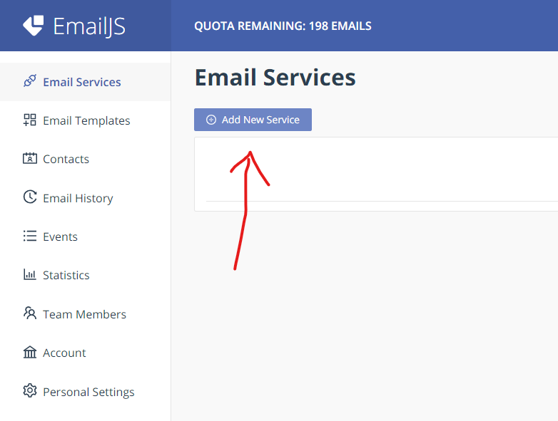
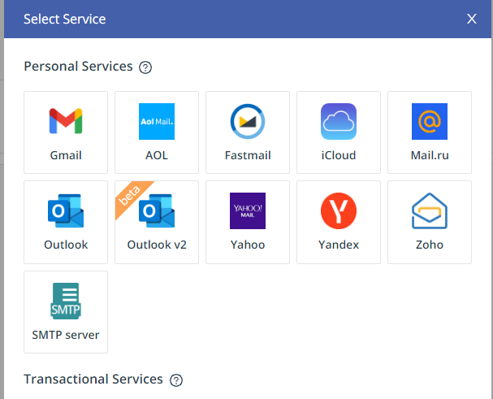
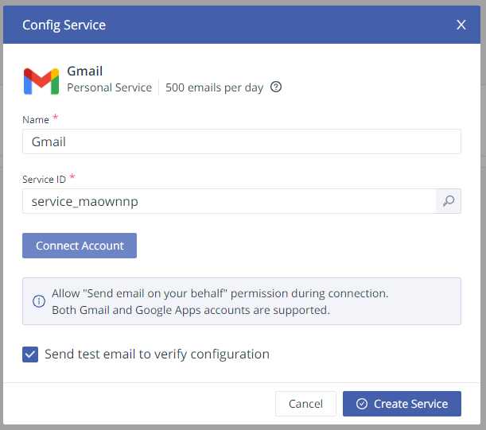
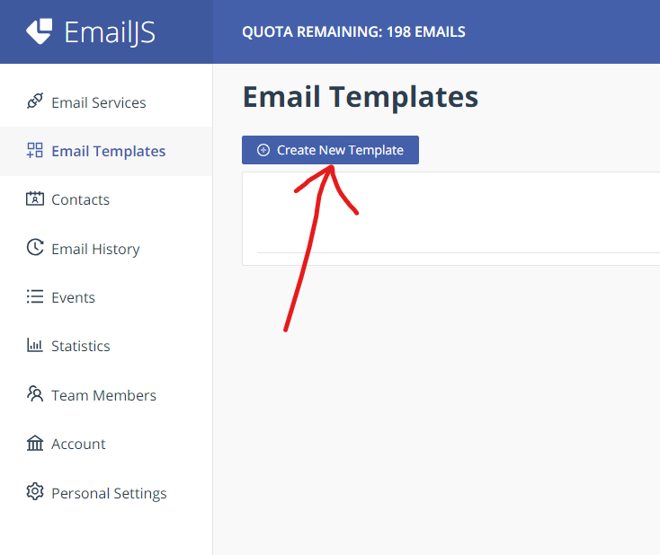
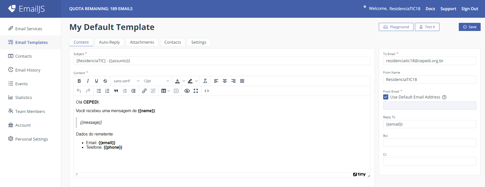
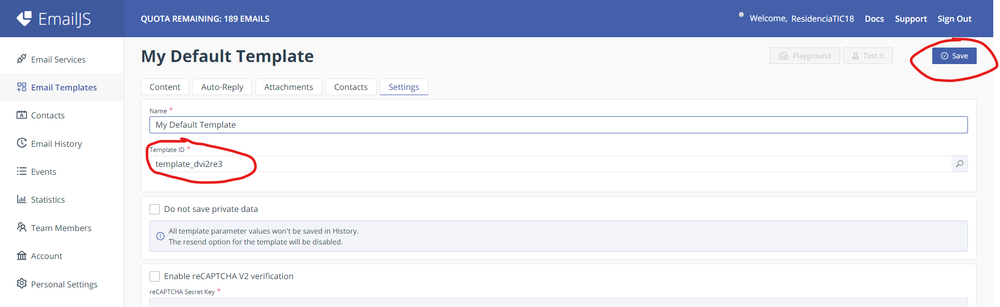
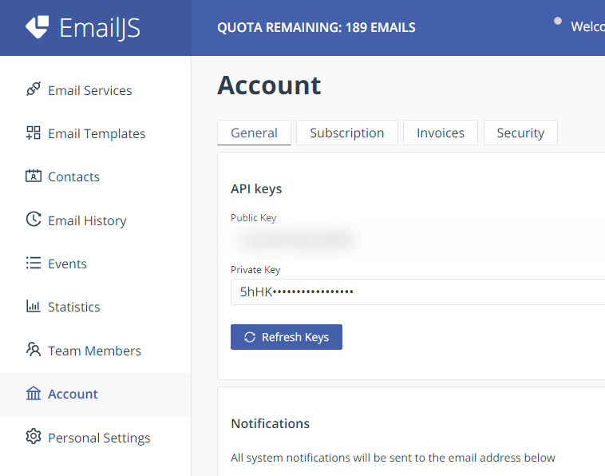

# Residência em Software

[Ver demonstração](https://residencia-next.vercel.app/)

<details>
    <summary>Sumário</summary>
    <ol>
        <li>
            <a href="#sobre">Sobre</a>
        </li>
        <li>
            <a href="#tecnologias">Tecnologias</a>
        </li>
        <li>
            <a href="#como-rodar-o-projeto">Como rodar o projeto</a>
        </li>
        <li>
            <a href="#estrutura-do-código">Estrutura do código</a>
        </li>
        <li>
            <a href="#como-fazer-deploy">Como fazer deploy</a>
        </li>
        <li>
            <a href="#autor">Autor</a>
        </li>
    </ol>
</details>

## Sobre

O objetivo desse projeto é desenvolver um site para a Residência em Software proposto pela UESC + CEPEDI + Softex + Governo da Bahia.

## Tecnologias

O projeto foi desenvolvido com base no [NextJS 13](https://nextjs.org/) (com o AppRouter) e utilizando [TypeScript](https://www.typescriptlang.org/).

Para o uso de ícones, foi utilizado o [React Icons](https://react-icons.github.io/react-icons/).

Para a estilização, foi utilizado o Module CSS, padrão do NextJS.

Para o uso de imagens, não foi possível utilizar o [Next Image](https://nextjs.org/docs/api-reference/next/image), pois ocorre uma incompatibilidade quando é gerado os arquivos de produção. Por isso, não foi utilizado nenhuma biblioteca para o uso de imagens.

Foi necessário utilizar uma biblioteca para envio de emails, e foi utilizado o [@emailjs/browser](https://www.emailjs.com/).

## Como rodar o projeto

Para rodar o projeto, é necessário ter o [NodeJS](https://nodejs.org/) instalado.

Após clonar o projeto, é necessário instalar as dependências:

```bash
npm install
```

Após instalar as dependências, é necessário criar um arquivo `.env` na raiz do projeto, você pode fazer uma cópia do arquivo `.env.example` e renomear para `.env`.

Após criar o arquivo `.env`, é necessário preencher as variáveis de ambiente:

```env
EMAILJS_SERVICE_ID= # ID do serviço do EmailJS
EMAILJS_TEMPLATE_ID= # ID do template do EmailJS
EMAILJS_USER_ID= # ID do usuário do EmailJS
```

Para conseguir essas informações, é necessário criar uma conta no [EmailJS](https://www.emailjs.com/).

Com a conta criada, é necessário criar um serviço, você pode se basear nas imagens abaixo:



Escolha seu provedor de email. (Nesse projeto, foi utilizado o Gmail)



Conecte sua conta, copie o `Service ID` (e coloque no `.env`) e clique em `Create Service`.



----

Após criar o serviço, é necessário criar um template, você pode se basear nas imagens abaixo:



Configure o template da seguinte forma:



Vá na aba `Settings`, copie o `Template ID` (e coloque no `.env`) e clique em `Save`.



----

Por fim, precisamos da `Public Key`, você pode se basear nas imagens abaixo:



Vá na aba `Account`, copie a `Public Key` (e coloque no `.env`).

----

Com todas as variáveis de ambiente preenchidas, podemos rodar o projeto:

```bash
npm run dev
```

O projeto estará rodando em [http://localhost:3000](http://localhost:3000).

## Estrutura do código

A estrutura do código está da seguinte forma:

```
├── app/
│   └── rota/
│       ├── page.tsx
│       └── rota.module.css
└── components/
    └── Componente/
        ├── index.tsx
        └── componente.module.css
```

Onde:

- `rota`: É uma rota do site. Utilizando o AppRouter, é possível criar rotas com base em pastas.
- `Componente`: É um componente do site.


## Como fazer deploy

Para fazer deploy do projeto, para colocar na hospedagem do CEPEDI, é necessário descomentar as linhas 3 e 4 do arquivo `next.config.js`, deixando-o da seguinte forma:

```js
/** @type {import('next').NextConfig} */
const nextConfig = {
	output: "export",
	distDir: "dist",
}

module.exports = nextConfig
```

Após descomentar as linhas, você pode rodar o comando:

```bash
npm run build
```

Após rodar o comando, será gerado uma pasta `dist`, que é a pasta que será colocada na hospedagem.

Selecione todos os arquivos dentro dessa pasta e coloque na hospedagem.

## Autor

- [Igor Rocha](https://ilrocha.com)